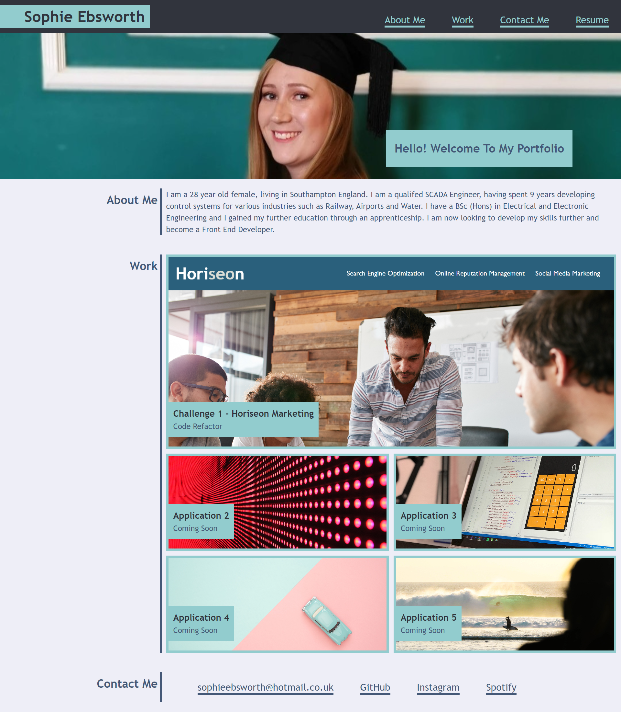

# Sophie-Ebsworth-Portfolio
## Description

This website is to showcase me to other people and businesses. It explains a litle bit about me, examples of work that I've done in front end devleopment and how to contact me. 

## Usage

There is a nav bar at the top of the page which is a way to navigate to the relvant sections (About Me, Work, Contact Me and a placeholder Resume Link)

    ```md
    
    ```

## Credits

Thank you to the following people:
 - Martin William (TA), thank you for responding to my messages over slack and helping me with the image linking
 - Matthew Calimbas (Tutor), thank you for helping me confirm my knowledge and help me with some minor issues I had! Also he provided me with more links to resources that was very helpful!

Thank you to the following websites for resource that I kept refering back to:
 - https://css-tricks.com/snippets/css/complete-guide-grid/
 - https://developer.mozilla.org/en-US/docs/Web/CSS/CSS_grid_layout/Basic_concepts_of_grid_layout
 - https://www.w3schools.com/howto/howto_css_vertical_line.asp - I used w3schools for a lot of topics but I did use the code from this webpage to create the vertical lines
 - Chatgpt - thank you for explain grids in a different way and helping me with checking my code. 

 Thank you to Laura Cole (Instructor) and the TA's for the support and guidance, along with the class resources as I have used them to refer back too and help me create my portfolio. 

## License

Please refer to the LICENSE in the repo.
